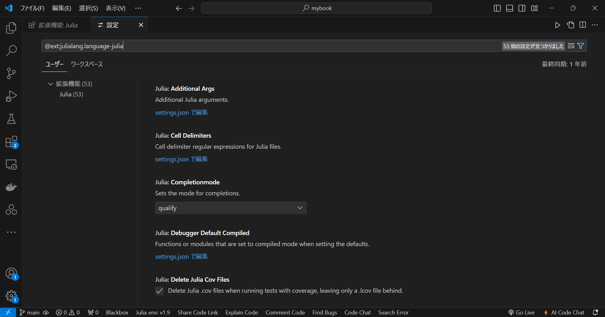

# Julia の導入

## インストール

[公式ドキュメント](https://julialang.org/downloads/)に従い, Julia をインストールする.

Julia の使い方は, インタラクティブ・セッション (Read-Eval-Print Loop, REPL)とスクリプトの2つに大別される. 本サイトでは, 基本的にスクリプトを使用する.

## Julia in VScode

また, 本サイトでは, Visual Studio Code (以降, VScode) で Julia を実行する. 以下に, VScode における Julia の導入について示す. なお, VScode のインストールについては省略する.

### 1. Julia の拡張機能インストール

まず, VScode の拡張機能から Julia (拡張機能ID: julialang.language-julia) を選択し, インストールする.


なお, 以降ではこの拡張機能を Julia-VScode と称する.

### 2. パス設定

次に, ローカルにインストールした Julia のパスを VScode に通す.

`settings.json` に以下の記述を追加する.

```json
"julia.executablePath": "\\Users\\yoneyama\\AppData\\Local\\Programs\\Julia-1.9.0\\bin\\julia.exe"
```

```{note}
上記には, 例として私のパスを示したが, 実際には自身のコンピュータにおける Julia のパスを指定する必要がある. 
```

参考までに, 私の設定を以下に示す.

```json
"julia.executablePath": "\\Users\\yoneyama\\AppData\\Local\\Programs\\Julia-1.9.0\\bin\\julia.exe",
"julia.symbolCacheDownload": true,
"julia.enableCrashReporter": false,
"julia.enableTelemetry": false,
```

### julia.executablePath

`julia.executablePath` は, 先ほど説明した実行ファイルのパスを指定するためのものである.

### julia.symbolCacheDownload

`julia.symbolCacheDownload` は, シンボルサーバキャッシュファイルをGitHub からダウンロードし, ローカルに保存するための設定である. デフォルトは `null` で, `true` にするとキャッシュファイルをダウンロードでき, `false` でダウンロードを無効化できる.

### julia.enableCrashReporter, julia.enableTelemetry

`julia.enableCrashReporter`, `julia.enableTelemetry` は, Julia-VScode が機能改善のために行っているユーザの使用状況データ・クラッシュレポートの収集及び開発チームへのデータ送信に関する設定である.  両者ともに, `true` にするとデータ収集・送信を有効化でき, `false` にするとデータ収集・送信を無効化できる. なお, デフォルトでは両者とも `null` となっており, この状態ではデータ収集・送信は行われないが, UI がユーザに対してデータ収集・送信の同意を求めてくる. 環境構築時, 何を思って無効化したのか覚えていないがこのままにしておく. 基本的には `true` で良いと思う. 詳細は Julia-VScode の[プライバシーポリシー](https://github.com/julia-vscode/julia-vscode/wiki/Privacy-Policy)を参照されたい.

なお, Julia-VScode では, ここで述べた機能の他にも数多くの機能を提供している. 詳細は Julia-VScode の[公式ドキュメント](https://www.julia-vscode.org/docs/v1.3/)や [`package.json`](https://github.com/julia-vscode/julia-vscode/blob/main/package.json) を参照されたい.

また, 今回は `settings.json` に直接記述したが, Julia-VScode の拡張機能画面から, `管理 > 拡張機能を設定` とするか, `Ctrl+Shift+P` でコマンドパレットを表示し, `@ext:julialang.language-julia` と入力することで Julia-VScode の設定画面に遷移し, より直感的に設定をすることができる.



## 環境

Julia のバージョンは以下の通り.

```Julia
julia> using InteractiveUtils
julia> versioninfo()
Julia Version 1.9.0
Commit 8e63055292 (2023-05-07 11:25 UTC)
Platform Info:
  OS: Windows (x86_64-w64-mingw32)
  CPU: 8 × 11th Gen Intel(R) Core(TM) i5-1155G7 @ 2.50GHz
  WORD_SIZE: 64
  LIBM: libopenlibm
  LLVM: libLLVM-14.0.6 (ORCJIT, tigerlake)
  Threads: 1 on 8 virtual cores
Environment:
  JULIA_EDITOR = code
  JULIA_NUM_THREADS =
```

また, VScode のバージョンは以下の通り.

```shell
> code --version
1.89.1
dc96b837cf6bb4af9cd736aa3af08cf8279f7685
x64
```

### 総括

> OS: Windows 11 Pro  
> Julia: Version 1.9.0  
> VScode: Version 1.89.1  
