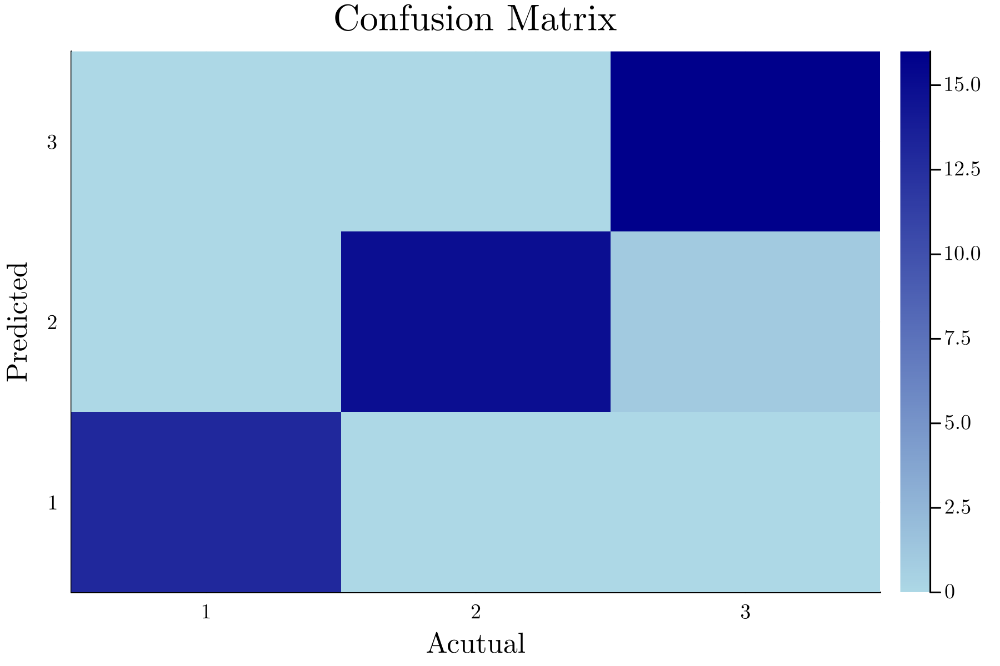
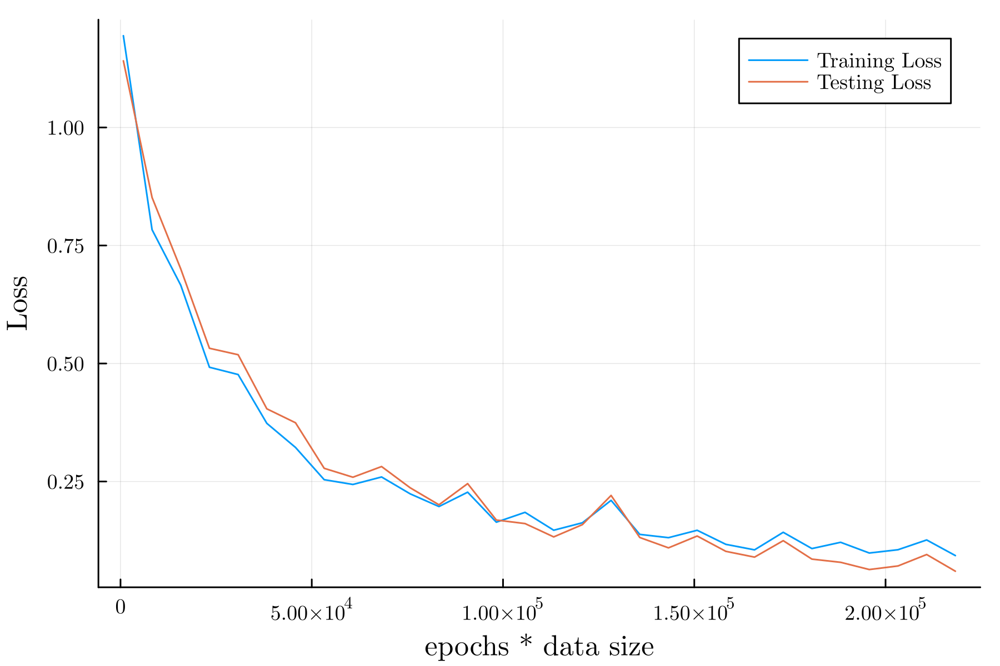

# Iris Dataset

## 準備

必要なパッケージを読み込む.

```Julia
using Flux, DataFrames, Random, RDatasets
using Flux: params, Data.DataLoader
using MLDataUtils: shuffleobs
```

## Iris データの読み込み

```Julia
iris = dataset("datasets", "iris")
```

まずは, Iris データの構造を見てみる.

```Julia
julia> describe(iris, :all)
5×16 DataFrame
 Row │ variable     mean     std       min     q25     median  q75     max        sum     nunique  nuniqueall  nmissing  nnonmissin ⋯
     │ Symbol       Union…   Union…    Any     Union…  Union…  Union…  Any        Union…  Union…   Int64       Int64     Int64      ⋯
─────┼───────────────────────────────────────────────────────────────────────────────────────────────────────────────────────────────
   1 │ SepalLength  5.84333  0.828066  4.3     5.1     5.8     6.4     7.9        876.5                    35         0          15 ⋯
   2 │ SepalWidth   3.05733  0.435866  2.0     2.8     3.0     3.3     4.4        458.6                    23         0          15
   3 │ PetalLength  3.758    1.7653    1.0     1.6     4.35    5.1     6.9        563.7                    43         0          15
   4 │ PetalWidth   1.19933  0.762238  0.1     0.3     1.3     1.8     2.5        179.9                    22         0          15
   5 │ Species                         setosa                          virginica          3                 3         0          15 ⋯

```

これでは全て表示されないので外部ファイルにリダイレクトする.

```Julia
description = describe(iris, :all)
open("describe_iris.txt", "w") do file
    write(file, string(description))
end
```

`describe_iris.txt` は以下の通り.

```text
5×16 DataFrame
 Row │ variable     mean     std       min     q25     median  q75     max        sum     nunique  nuniqueall  nmissing  nnonmissing  first   last       eltype
     │ Symbol       Union…   Union…    Any     Union…  Union…  Union…  Any        Union…  Union…   Int64       Int64     Int64        Any     Any        DataType
─────┼───────────────────────────────────────────────────────────────────────────────────────────────────────────────────────────────────────────────────────────────────────────────────
   1 │ SepalLength  5.84333  0.828066  4.3     5.1     5.8     6.4     7.9        876.5                    35         0          150  5.1     5.9        Float64
   2 │ SepalWidth   3.05733  0.435866  2.0     2.8     3.0     3.3     4.4        458.6                    23         0          150  3.5     3.0        Float64
   3 │ PetalLength  3.758    1.7653    1.0     1.6     4.35    5.1     6.9        563.7                    43         0          150  1.4     5.1        Float64
   4 │ PetalWidth   1.19933  0.762238  0.1     0.3     1.3     1.8     2.5        179.9                    22         0          150  0.2     1.8        Float64
   5 │ Species                         setosa                          virginica          3                 3         0          150  setosa  virginica  CategoricalValue{String, UInt8}

```

ちなみに, これではアヤメの品種がすべて表示されていいないため, 以下のようにする.

```Julia
julia> unique(iris.Species)
3-element Vector{String}:
 "setosa"
 "versicolor"
 "virginica"

```

これにより, アヤメの品種として `setosa` , `versicolor` , `virginica` が含まれることが確認できた.

アヤメの品種 (`setosa` , `versicolor` , `virginica`) を特定するためのデータとして `SpealLength` , `SpealWodth` , `PetalLength` , `PetalWidth` が存在している. 

## 目的変数と説明変数の定義

目的変数として `SpealLength` , `SpealWidth` , `PetalLength` , `PetalWwidth` , 説明変数として `Species` を選択する.

```Julia
X = select(iris, Not(:Species)) |> Matrix
y = iris[:, :Species]
```

なお, `X` は `DataFrame` であるが, 今後の処理のため, `Matrix` に変換している.

## 訓練データとテストデータに分離

訓練データとテストデータに分割する. ここでは, 「訓練データ：テストデータ = 7：1」で分割する.

```Julia
function partition(data, labels, at = 0.7)
    n = size(data, 1)
    idx = shuffle(1:n)
    train_idx = view(idx, 1:floor(Int, at*n))
    test_idx = view(idx, (floor(Int, at*n)+1):n)
    return data[train_idx, :], labels[train_idx], data[test_idx, :], labels[test_idx]
end

x_train, y_train, x_test, y_test = partition(X, y, 0.7)
```

## One-Hot エンコーディング

目的変数を数値化するために, One-Hot エンコーディングを行う.

```Julia
y_train = Flux.onehotbatch(y_train, unique(iris.Species))
y_test = Flux.onehotbatch(y_test, unique(iris.Species))
```

## データローダ作成

```Julia
batch_size = 16
train_dl = DataLoader((x_train', y_train), batchsize=batch_size, shuffle=true)
test_dl = DataLoader((x_test', y_test), batchsize=batch_size)
```

## モデル定義

以下のようなモデルを定義する.

**入力層：**

- 入力：$x\in\mathbb{R}^{4}$
- 出力：$h^{(1)}=\mathrm{ReLU}(\mathbf{W}^{(1)}+b^{(1)}), \quad \mathbf{W}^{(1)},\, b^{(1)}\in\mathbb{R}^{32}$
- 活性化関数：$\mathrm{ReLU}(z)=\max(0,z)$
  
**中間層：**

- 入力：$h^{(1)}\in\mathbb{R}^{32}$
- 出力：$h^{(2)}=\mathbf{W}^{(2)}h^{(1)}+b^{(2)}, \quad \mathbf{W}^{(2)}\in\mathbb{R}^{3\times32},\, b^{(2)}\in\mathbb{R}^{3}$
- 活性化関数：なし
  
**出力層：**

- 入力：$h^{(2)}\in\mathbb{R}^{3}$
- 出力：$\hat{y}=\mathrm{softmax}(h^{(2)})$

```Julia
model = Chain(
    Dense(4, 32, relu),
    Dense(32, 3),
    softmax
)
```

## 損失関数

損失関数にはクロスエントロピーを利用する.

**クロスエントロピー：**

$$
\begin{equation*}
L(x, y) = -\sum_{i=1}^{3}y_{i}\log (\hat{y}_{i})
\end{equation*}
$$


```Julia
loss(x, y) = Flux.crossentropy(model(x), y)

train_losses = []
test_losses = []
train_acces = []
test_acces = []
```

## 最適化手法

ここでは, 最適化手法として ADAM を選択する.

**ADAM：**

$$
\begin{equation*}
\theta_{t+1} = \theta_{t} - \eta\dfrac{\hat{m}_{t}}{\sqrt{\hat{u}_{t}}+\varepsilon}
\end{equation*}
$$

```Julia
lr = 0.001
opt = ADAM(lr, (0.9, 0.999))
```

## Callbacks

`train!()` 内で呼び出す `callbacks` を作成する.

```Julia
function loss_all(data_loader)
    return sum([loss(x, y) for (x, y) in data_loader]) / length(data_loader)
end

function acc(data_loader)
    f(x) = Flux.onecold(cpu(x))
    acces = [sum(f(model(x)) .== f(y)) / size(x, 2) for (x, y) in data_loader]
    return sum(acces) / length(data_loader)
end

callbacks = [
    () -> push!(train_losses, loss_all(train_dl)),
    () -> push!(test_losses, loss_all(test_dl)),
    () -> push!(train_acces, acc(train_dl)),
    () -> push!(test_acces, acc(test_dl)),
]
```

`loss_all()` は損失の和を返し, `acc()` は正答率を返す.

## 訓練

モデルの特訓を行う. なお, 特訓に関して, 全データでの特訓を `epochs` 回行う.

```Julia
ps = Flux.params(model)

epochs = 100
for epoch in 1:epochs
    Flux.train!(loss, ps, train_dl, opt, cb = callbacks)
end
```

## 結果の表示

```Julia
println("Train Error: $(loss_all(train_dl))")
println("Test Error: $(loss_all(test_dl))")
println("Train Accuracy: $(acc(train_dl))")
println("Test Accuracy: $(acc(test_dl))")
```

例として, 周回数を $100$ としたときの結果を以下に示す.

```Julia
Train Error: 0.24635728

Test Error: 0.2152909

Train Accuracy: 0.9732142857142857

Test Accuracy: 0.9583333333333334

```

## 予測の例

予測の一例を以下に示す.

```Julia
pred = []
truth = []
for i in 1:length(x_test[:, 1])
    push!(pred, f(model(x_test[i, :])))
    push!(truth, f(y_test[:, i]))
end
```

```Julia

julia> pred'
1×45 adjoint(::Vector{Any}) with eltype Any:
 3  2  2  3  2  3  3  3  3  3  1  3  3  1  2  2  3  2  2  2  2  1  1  1  2  2  1  1  1  1  2  3  2  1  1  3  3  3  2  3  3  3  1  2  1

julia> truth'
1×45 adjoint(::Vector{Any}) with eltype Any:
 3  2  2  3  2  3  2  3  3  3  1  3  3  1  2  2  3  2  2  2  2  1  1  1  2  2  1  1  1  1  2  3  2  1  1  3  3  3  2  3  3  3  1  2  1     

```

上記では, 結果を見やすくするためにあえて転置している. 上記の結果を混同行列の表にしたものを以下に示す.

```Julia
julia> ConfusionMatrices.confmat(truth, pred)
          ┌──────────────┐
          │ Ground Truth │
┌─────────┼────┬────┬────┤
│Predicted│ 1  │ 2  │ 3  │
├─────────┼────┼────┼────┤
│    1    │ 13 │ 0  │ 0  │
├─────────┼────┼────┼────┤
│    2    │ 0  │ 15 │ 1  │
├─────────┼────┼────┼────┤
│    3    │ 0  │ 0  │ 16 │
└─────────┴────┴────┴────┘

```

また, `heatmap` にしたものを以下に示す.



## 最終的な結果

**Loss：**



**Accuracy：**


### 参考文献

- Luke Floden, "Deep learning on "the iris data-set" in Julia", DEV, 2020-11-10, [https://dev.to/bionboy/deep-learning-on-the-iris-data-set-in-julia-3pbe](https://dev.to/bionboy/deep-learning-on-the-iris-data-set-in-julia-3pbe), (2024-06-17 参照).
  