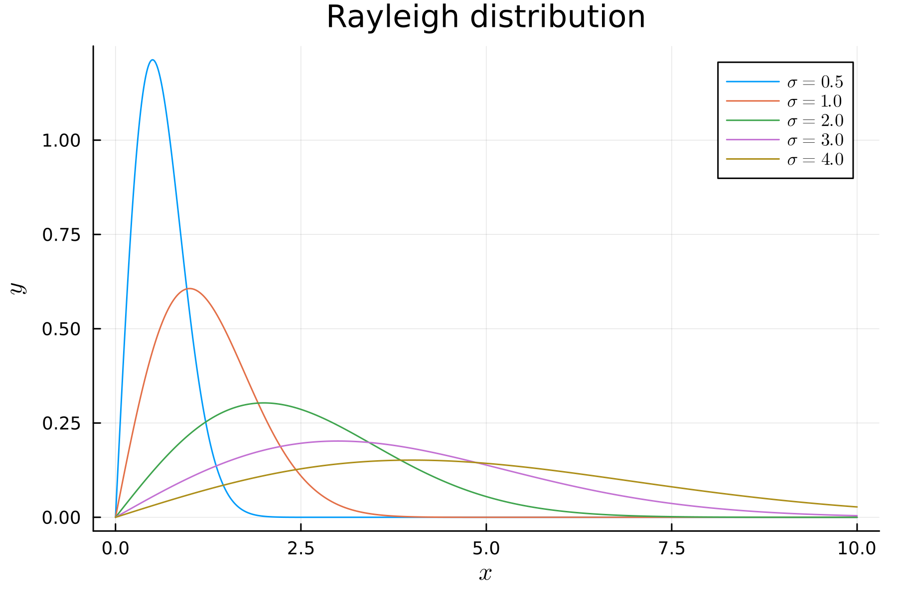
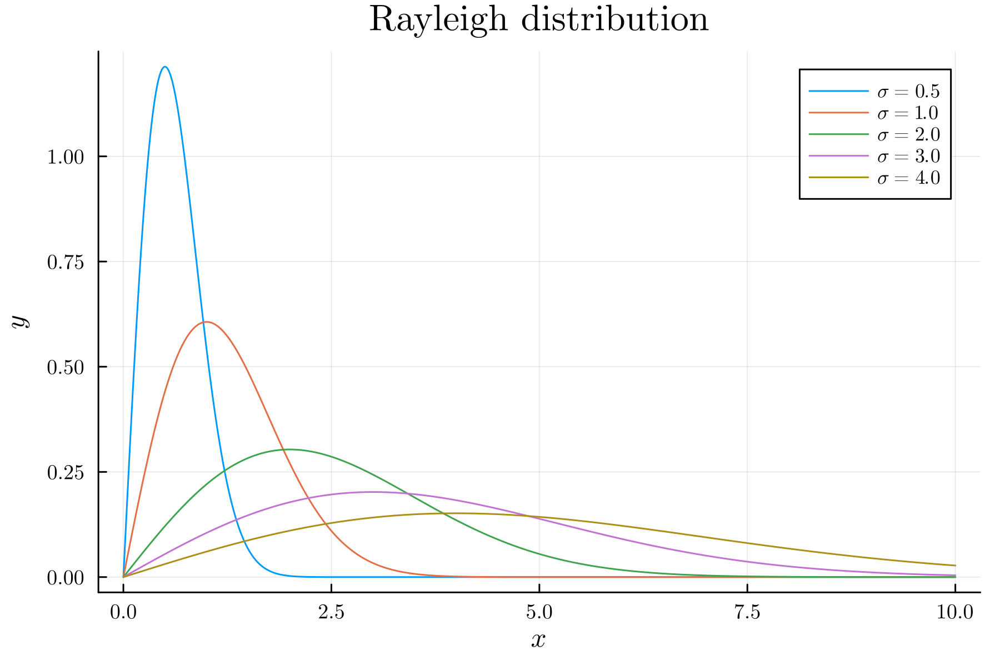

# PlotsでLaTeX表記

Plots で LaTeX 表記を使用したい場合, バックグラウンドとして PGFPlotsX を用いればよいが初期実行が遅い. そのため, ここでは GR を用いた LaTeX 表記について述べる.

まず, LaTeXStrings をインストールする.

```Julia
(@v1.9) pkg> add LaTeXStrings
```

または,

```Julia
using Pkg
Pkg.add("LaTeXStrings")
```

例として, レイリー分布の確率密度関数

$$
\begin{equation*}
f(x|\sigma)=\dfrac{x}{\sigma^{2}}e^{-\frac{x^{2}}{2\sigma^{2}}}
\end{equation*}
$$

を描画する.

まず, 必要なパッケージを読み込む.

```Julia
using Plots, LaTeXStrings
```

次に, レイリー分布の確率密度関数を定義する.

```Julia
function f(x, σ)
    return x / σ^2 * exp(-x^2 / (2 * σ^2))
end
```

今回は, $0\leq x\leq10$ の範囲で描画する.

```Julia
x = 0:0.01:10

plot(x, f.(x, 0.5), xlabel=L"x", ylabel=L"y", label=L"\sigma=0.5", title="Rayleigh distribution", dpi=300)
plot!(x, f.(x, 1.0), label=L"\sigma=1.0")
plot!(x, f.(x, 2.0), label=L"\sigma=2.0")
plot!(x, f.(x, 3.0), label=L"\sigma=3.0")
plot!(x, f.(x, 4.0), label=L"\sigma=4.0")
```

LaTeXStrings では, `L""` でLaTeX形式の文字列を記述する. 実際に描画した結果を以下に示す.



このままでは, タイトルと軸の目盛り値にLaTeX表記が適用されていない. タイトルにも同様にして, `title=L""` とすれば良いが, `\mathrm{}` で数式内の文字を立体にしたり, `\,` や `\quad` で空白を認識させなければならないため面倒である. そこで, LaTeX で標準的に使用されている Computer Modern フォントを利用する. 具体的には以下のようにする.

```Julia
plot_font = "Computer Modern"
default(fontfamily=plot_font, linewidth=1, label=nothing, grid=true)
```

上記のコードでは, `plot_font` で Computer Modern を指定し, `default()` で描画のデフォルト設定を変更している. Computer Modern を使用すると以下のようになる.



美しい.
