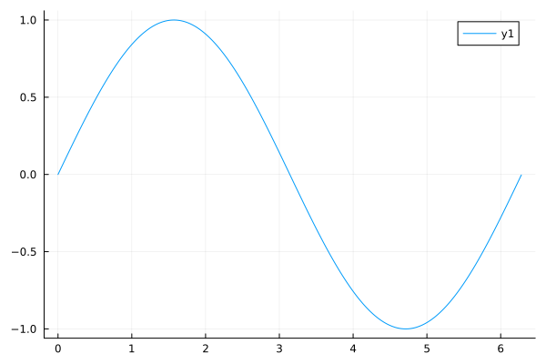
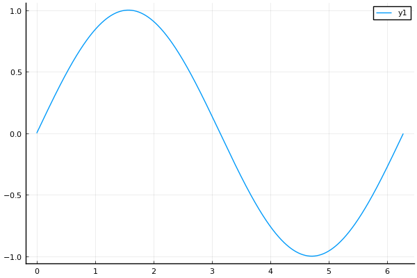
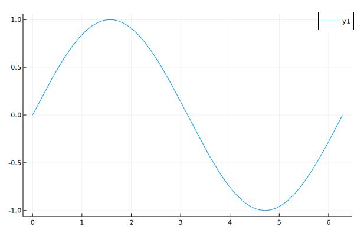
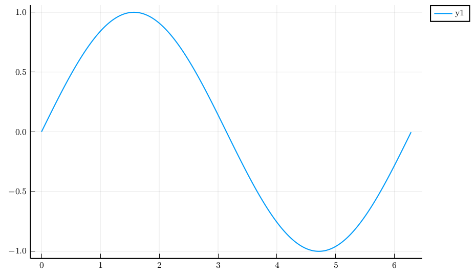
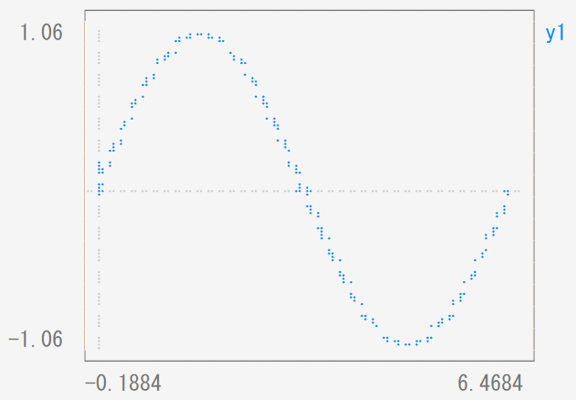
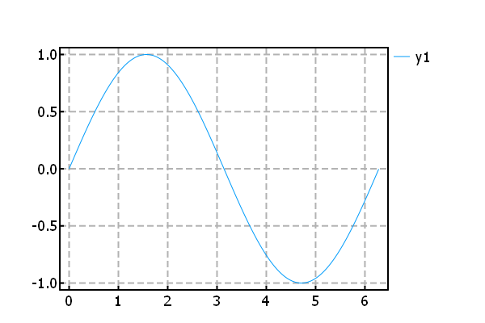
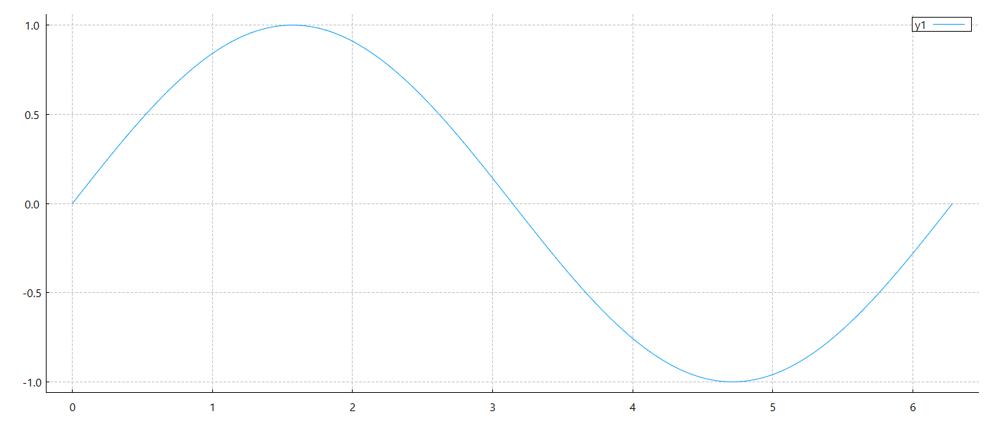

# Plots

Julia でグラフを描画する方法は複数あるが, ここでは Plots を扱う.

まずは, Plots をインストールする.

```Julia
(@v1.9) pkg> add Plots
```

または,

```Julia
using Pkg
Pkg.add("Plots")
```

次に, バックエンドをインストールする. Plots で扱えるバックエンドは複数ある.

| バックエンド | 特徴 |
| ---- | ---- |
| GR | デフォルト, 高速 (個人的に一番好き...) |
| PyPlot | Python の Matplotlib を使用 |
| PythonPlot | Python の Matplotlib を使用 |
| Plotly/PlotlyJS | インタラクティブなグラフの描画が可能 |
| PGFPlotsX | LaTex の PGF/Tikz を使用して高品質なグラフの描画が可能 |
| UnicodePlots | ターミナルでグラフを描画 |
| InspectDR | 高速 |
| Gaston | Gnuplot を使用 |

```{warning}
PyPlot は非推奨となったため, PythonPlot に移行した方がよさそう.
```

例として,

$$
\begin{equation*}
y=\sin x,\quad 0\leq x\leq2\pi
\end{equation*}
$$

を各バックエンドで描画する.

| GR |
| --- |
||

| PythonPlot |
| --- |
||

| PlotlyJS |
| --- |
||

| PGFPlotsX |
| --- |
||

| UnicodePlots |
| --- |
||

| InspectDR |
| --- |
||

| Gaston |
| --- |
||

プロット時間は以下の通り. なお, 平均実行時間導出にあたり, 各バックエンドにおいてそれぞれ100回実行した. なお, バックエンドは `gr()` や `pythonplot()` のようにして設定できる. 何も設定しない場合はデフォルトで `gr()` となっている.

| バックエンド | 初回実行時間 [s] | 平均実行時間 [s] |
| --- | --- | --- |
| GR | 0.133777 | 0.000233 |
| PythonPlot | 0.920604 | 0.000226 |
| PlotlyJS | 0.760624 | 0.000220 |
| PGFPlotsX | 0.917138 | 0.000229 |
| UnicodePlots | 0.679810 | 0.000411 |
| InspectDR | 0.834717 | 0.000401 |
| Gaston | 0.755034 | 0.000493 |

総合的にみると, やはり GR が速い.
なお, 本サイトでは基本的に Plots + GR でグラフ描画を行う.
