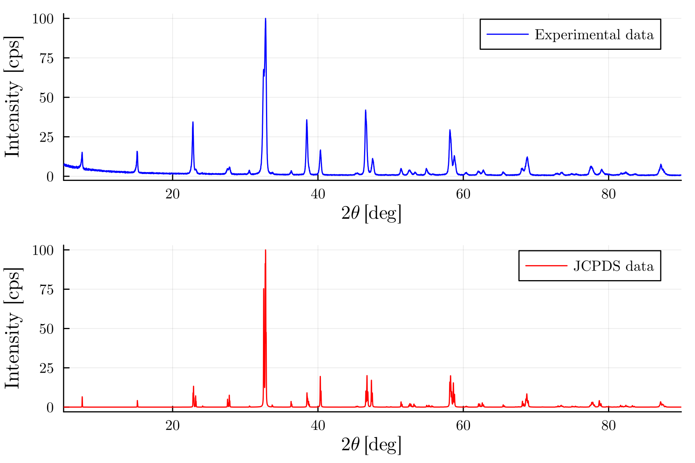

# XRD

```Julia
using Plots, LaTeXStrings
plot_font = "Computer Modern"
default(fontfamily=plot_font, linewidth=1, label=nothing, grid=true)

file = open("normal_xrd.xy", "r")

x_values_exp = Float64[]
y_values_exp = Float64[]
for line in eachline(file)
    parts = split(line)
    push!(x_values_exp, parse(Float64, parts[1]))
    push!(y_values_exp, parse(Float64, parts[2]))
end

close(file)

file = open("YBCO_xy.xy", "r")

x_values_jcpds = Float64[]
y_values_jcpds = Float64[]
for line in eachline(file)
    parts = split(line)
    push!(x_values_jcpds, parse(Float64, parts[1]))
    push!(y_values_jcpds, parse(Float64, parts[2]))
end

close(file)

plot(
    plot(x_values_exp, y_values_exp, label="Experimental data", xlims=(5.0, 90.0), xlabel=L"2\theta \mathrm{\, \, [deg]}", ylabel="Intensity [cps]", linecolor=:blue, dpi=300),
    plot(x_values_jcpds, y_values_jcpds, label="JCPDS data", xlims=(5.0, 90.0), xlabel=L"2\theta \mathrm{\, \, [deg]}", ylabel="Intensity [cps]", linecolor=:red, dpi=300),
    layout=(2,1),
    legend=:topright
)
```


